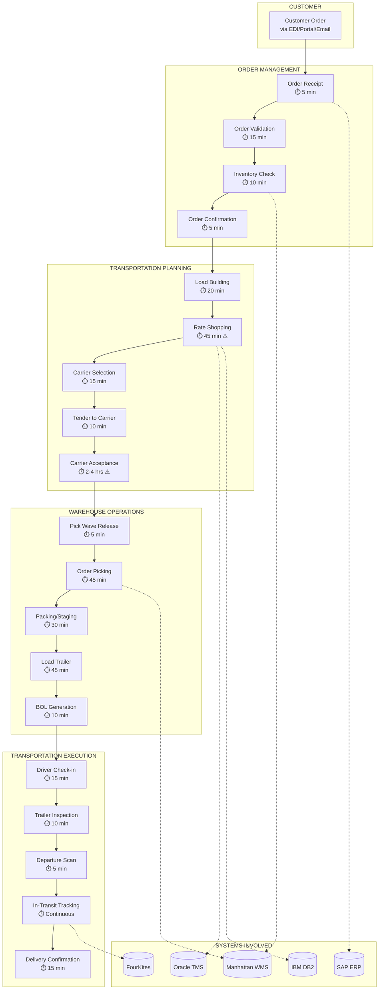
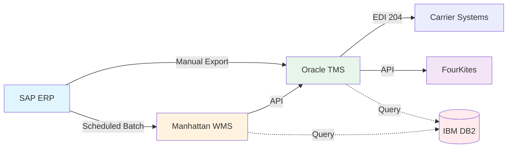

# Value Stream Map: Order-to-Delivery Process
## Midwest Premier Logistics

---

## Process Metrics Summary

| Phase | Steps | Total Time | Value-Add Time | Wait Time | Systems |
|-------|-------|------------|----------------|-----------|---------|
| Order Management | 4 | 35 min | 30 min | 5 min | SAP, WMS |
| Transportation Planning | 5 | 3-5 hrs | 1.5 hrs | 2-4 hrs | TMS, DB2 |
| Warehouse Operations | 5 | 2.25 hrs | 2 hrs | 15 min | WMS |
| Transportation Execution | 5 | Variable | 45 min | N/A | TMS, FourKites |

**Total Lead Time:** 6-8 hours (same-day) to 24+ hours (standard)

---

## Pain Points Identified (⚠️)

### 1. Rate Shopping (45 min)
- **Current State:** Manual process across multiple carrier portals
- **Root Cause:** No API integration, spreadsheet-based comparison
- **Impact:** Delays load confirmation, reduces carrier options
- **AI Opportunity:** Automated rate aggregation and recommendation

### 2. Carrier Acceptance (2-4 hrs)
- **Current State:** Email/phone back-and-forth
- **Root Cause:** Carriers check capacity manually, no real-time visibility
- **Impact:** Uncertainty in pickup scheduling, warehouse staging delays
- **AI Opportunity:** Predictive acceptance scoring, auto-escalation

### 3. Data Silos
- **Current State:** 5 systems with limited integration
- **Root Cause:** Legacy architecture, point-to-point interfaces
- **Impact:** Manual data entry, reconciliation errors
- **AI Opportunity:** Unified data layer, exception detection

---

## Handoff Points (Integration Gaps)

| From | To | Integration Type | Frequency | Reliability |
|------|-----|-----------------|-----------|-------------|
| SAP → TMS | Manual CSV | Daily | 95% |
| SAP → WMS | Batch API | Hourly | 98% |
| WMS → TMS | Real-time API | Event-driven | 99% |
| TMS → Carrier | EDI 204/990 | Real-time | 97% |
| TMS → FourKites | API | Real-time | 99% |
| WMS → DB2 | Query | On-demand | 99% |

---

## AI Workflow Opportunities

### Quick Wins (0-3 months)
1. **Rate Shopping Automation**
   - Input: Lane, weight, equipment, date
   - Output: Ranked carrier options with confidence scores
   - Savings: 30 min/load × 50 loads/day = 25 hrs/day

2. **Exception Alerting**
   - Monitor: Delivery appointments, carrier acceptance, temp readings
   - Alert: Proactive notification with recommended actions
   - Impact: Reduce reactive fire-fighting by 40%

### Medium-Term (3-6 months)
3. **SOP Digitization**
   - Convert 40+ SOPs to structured workflows
   - Enable AI-assisted training and compliance checking
   - Reduce onboarding time by 50%

4. **Demand Forecasting Integration**
   - Combine historical data with customer forecasts
   - Pre-position inventory, pre-book carrier capacity
   - Improve on-time delivery by 3-5%

### Long-Term (6-12 months)
5. **Autonomous Planning**
   - AI builds loads, selects carriers, tenders shipments
   - Human approval for exceptions only
   - Target: 80% touchless load execution

---

*Document Owner: Sarah Chen, VP Operations*
*Last Updated: 2026-01-15*
*Version: 1.2*
